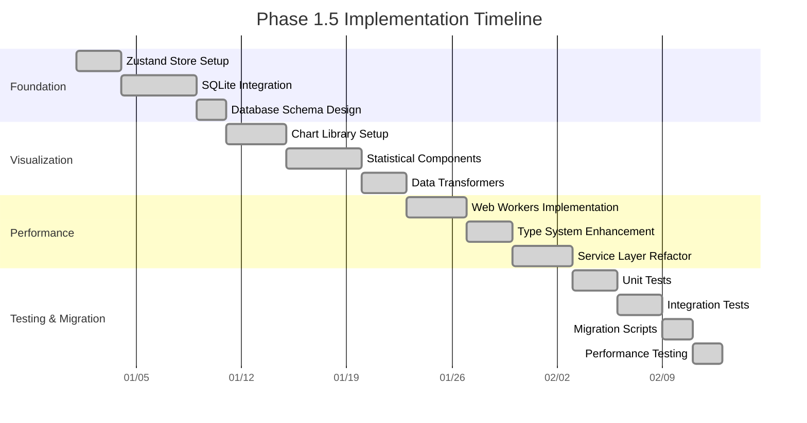

# Phase 1.5: Architectural Foundation Enhancement

## Overview

Phase 1.5 focuses on establishing a solid architectural foundation that will support the comprehensive Phase 2 expansion. This intermediate phase addresses core infrastructure improvements identified through architectural analysis, positioning StatDash for scalable growth and enhanced user experience.

## Core Objectives

### 1. **State Management Modernization**
**Current State:** React Context API with growing complexity
**Target State:** Zustand-based state management with persistence

### 2. **Data Persistence Layer**
**Current State:** No persistent storage
**Target State:** SQLite-based local storage with structured data management

### 3. **Visualization Pipeline**
**Current State:** Placeholder components and basic D3.js
**Target State:** Comprehensive chart library with statistical visualizations

### 4. **Performance Optimization**
**Current State:** Browser-thread computations
**Target State:** Web Workers and optimized rendering

### 5. **Type System Enhancement**
**Current State:** Basic TypeScript interfaces
**Target State:** Comprehensive type definitions with runtime validation

## Implementation Roadmap

### **Week 1-2: State Management & Persistence Foundation**

#### 1.1 Zustand Store Implementation
```typescript
// src/stores/simulation.store.ts
interface SimulationStore {
  // State
  currentSession: SimulationSession;
  simulationHistory: SimulationSession[];
  uiPreferences: UIPreferences;

  // Actions
  createSession: (params: MultiPairSimulationParams) => void;
  updateSession: (sessionId: string, updates: Partial<SimulationSession>) => void;
  deleteSession: (sessionId: string) => void;
  setUIPreferences: (prefs: Partial<UIPreferences>) => void;

  // Computed
  activePairs: SamplePair[];
  isLoading: boolean;
  hasUnsavedChanges: boolean;
}
```

#### 1.2 SQLite Database Schema
```sql
-- Core tables for StatDash persistence
CREATE TABLE sessions (
  id TEXT PRIMARY KEY,
  name TEXT NOT NULL,
  description TEXT,
  parameters TEXT NOT NULL, -- JSON
  results TEXT, -- JSON
  created_at DATETIME DEFAULT CURRENT_TIMESTAMP,
  updated_at DATETIME DEFAULT CURRENT_TIMESTAMP,
  is_active BOOLEAN DEFAULT 0
);

CREATE TABLE sample_pairs (
  id TEXT PRIMARY KEY,
  session_id TEXT NOT NULL,
  name TEXT NOT NULL,
  group1_params TEXT NOT NULL, -- JSON
  group2_params TEXT NOT NULL, -- JSON
  sample_size INTEGER NOT NULL,
  enabled BOOLEAN DEFAULT 1,
  FOREIGN KEY (session_id) REFERENCES sessions(id)
);

CREATE TABLE simulation_results (
  id TEXT PRIMARY KEY,
  session_id TEXT NOT NULL,
  pair_id TEXT NOT NULL,
  result_data TEXT NOT NULL, -- JSON
  created_at DATETIME DEFAULT CURRENT_TIMESTAMP,
  FOREIGN KEY (session_id) REFERENCES sessions(id),
  FOREIGN KEY (pair_id) REFERENCES sample_pairs(id)
);

CREATE TABLE ui_preferences (
  key TEXT PRIMARY KEY,
  value TEXT NOT NULL,
  updated_at DATETIME DEFAULT CURRENT_TIMESTAMP
);
```

#### 1.3 Database Service Layer
```typescript
// src/services/database.service.ts
class DatabaseService {
  private db: SQLiteDatabase;

  async initialize(): Promise<void> {
    // Initialize SQLite database
    // Create tables
    // Set up migrations
  }

  async saveSession(session: SimulationSession): Promise<void> {
    // Save session with related data
  }

  async loadSession(sessionId: string): Promise<SimulationSession> {
    // Load complete session with all related data
  }

  async getSessionHistory(): Promise<SimulationSession[]> {
    // Retrieve session list with metadata
  }
}
```

### **Week 3-4: Visualization Pipeline Implementation**

#### 2.1 Chart Library Integration
```typescript
// src/components/charts/ChartProvider.tsx
import { Chart as ChartJS } from 'chart.js';
import { registerables } from 'chart.js';
import zoomPlugin from 'chartjs-plugin-zoom';

// Register Chart.js components
ChartJS.register(...registerables, zoomPlugin);
```

#### 2.2 Statistical Chart Components
```typescript
// src/components/charts/PValueHistogram.tsx
interface PValueHistogramProps {
  data: HistogramBin[];
  significanceThreshold?: number;
  theme: 'light' | 'dark';
  interactive?: boolean;
  onBinClick?: (bin: HistogramBin) => void;
}

const PValueHistogram: React.FC<PValueHistogramProps> = ({
  data,
  significanceThreshold = 0.05,
  theme,
  interactive = true,
  onBinClick
}) => {
  // Implementation using Chart.js or Recharts
};
```

#### 2.3 Chart Data Transformers
```typescript
// src/utils/chart-transformers.ts
export class ChartDataTransformer {
  static transformPValueHistogram(results: SimulationResult[]): ChartData {
    // Transform simulation results to chart-ready format
  }

  static transformEffectSizeComparison(pairs: PairResult[]): ChartData {
    // Prepare effect size comparison data
  }

  static transformConfidenceIntervals(results: SimulationResult[]): ChartData {
    // Format confidence interval data for error bars
  }
}
```

### **Week 5-6: Performance & Type System Enhancement**

#### 3.1 Web Workers for Computations
```typescript
// src/workers/simulation.worker.ts
self.onmessage = async (e: MessageEvent<SimulationWork>) => {
  const { type, payload } = e.data;

  try {
    let result: any;

    switch (type) {
      case 'RUN_SIMULATION':
        result = await runStatisticalSimulation(payload);
        break;
      case 'CALCULATE_POWER':
        result = await calculatePowerAnalysis(payload);
        break;
      case 'TRANSFORM_DATA':
        result = await transformChartData(payload);
        break;
    }

    self.postMessage({ type: 'SUCCESS', result });
  } catch (error) {
    self.postMessage({ type: 'ERROR', error: error.message });
  }
};
```

#### 3.2 Enhanced Type Definitions
```typescript
// src/types/enhanced-simulation.types.ts
import { z } from 'zod';

// Runtime validation schemas
export const SamplePairSchema = z.object({
  id: z.string().uuid(),
  name: z.string().min(1).max(100),
  group1: PopulationParamsSchema,
  group2: PopulationParamsSchema,
  sample_size_per_group: z.number().int().min(2).max(10000),
  enabled: z.boolean().default(true)
});

export const SimulationSessionSchema = z.object({
  id: z.string().uuid(),
  name: z.string().min(1).max(200),
  description: z.string().optional(),
  parameters: MultiPairSimulationParamsSchema,
  results: MultiPairResultsSchema.optional(),
  created_at: z.date(),
  updated_at: z.date(),
  is_active: z.boolean().default(false)
});

// Type inference from schemas
export type SamplePair = z.infer<typeof SamplePairSchema>;
export type SimulationSession = z.infer<typeof SimulationSessionSchema>;
```

#### 3.3 Service Layer Refactoring
```typescript
// src/services/enhanced-simulation.service.ts
class EnhancedSimulationService {
  private worker: Worker;
  private db: DatabaseService;

  constructor() {
    this.worker = new Worker('./simulation.worker.ts');
    this.db = new DatabaseService();
  }

  async runSimulation(params: MultiPairSimulationParams): Promise<MultiPairResults> {
    // Use Web Worker for computation
    // Persist results to database
    // Update Zustand store
  }

  async saveSession(session: SimulationSession): Promise<void> {
    // Validate session data
    // Save to database
    // Update store
  }
}
```

## Technical Specifications

### **Dependencies to Add**
```json
{
  "dependencies": {
    "zustand": "^4.4.0",
    "zustand-middleware": "^1.0.0",
    "sql.js": "^1.8.0",
    "chart.js": "^4.4.0",
    "react-chartjs-2": "^5.2.0",
    "chartjs-plugin-zoom": "^2.0.0",
    "zod": "^3.22.0",
    "comlink": "^4.4.0",
    "localforage": "^1.10.0"
  },
  "devDependencies": {
    "@types/sql.js": "^1.4.4"
  }
}
```

### **File Structure Evolution**
```
src/
├── stores/
│   ├── simulation.store.ts
│   ├── ui.store.ts
│   └── chart.store.ts
├── services/
│   ├── database.service.ts
│   ├── enhanced-simulation.service.ts
│   ├── chart.service.ts
│   └── worker.service.ts
├── components/
│   ├── charts/
│   │   ├── base/
│   │   │   ├── ChartContainer.tsx
│   │   │   ├── ChartTooltip.tsx
│   │   │   └── ChartLegend.tsx
│   │   ├── statistical/
│   │   │   ├── PValueHistogram.tsx
│   │   │   ├── EffectSizeBoxPlot.tsx
│   │   │   ├── ConfidenceIntervalPlot.tsx
│   │   │   └── SignificanceMatrix.tsx
│   │   └── interactive/
│   │       ├── DrillDownChart.tsx
│   │       └── MultiPairComparison.tsx
│   └── layout/
│       ├── AppLayout.tsx
│       └── SidebarLayout.tsx
├── workers/
│   ├── simulation.worker.ts
│   └── chart.worker.ts
├── utils/
│   ├── chart-transformers.ts
│   ├── validation.ts
│   └── performance.ts
└── types/
    ├── enhanced-simulation.types.ts
    ├── chart.types.ts
    └── store.types.ts
```

## Migration Strategy

### **Incremental Migration Approach**

#### **Step 1: Parallel Implementation**
- Keep existing Context-based code functional
- Implement new Zustand stores alongside
- Create database service without affecting current flow

#### **Step 2: Component-by-Component Migration**
```typescript
// Before: Context-based component
const OldControlPanel = () => {
  const { params, setParams } = useAppContext();
  // ...
};

// After: Zustand-based component
const NewControlPanel = () => {
  const { params, setParams } = useSimulationStore();
  // ...
};
```

#### **Step 3: Feature Flags**
```typescript
// Feature flag system for gradual rollout
const FEATURE_FLAGS = {
  NEW_STATE_MANAGEMENT: true,
  DATABASE_PERSISTENCE: false, // Enable after testing
  ENHANCED_CHARTS: true,
  WEB_WORKERS: false // Enable after worker implementation
};
```

## Testing Strategy

### **Unit Tests**
```typescript
// src/__tests__/stores/simulation.store.test.ts
describe('Simulation Store', () => {
  it('should create and manage simulation sessions', () => {
    const store = createSimulationStore();
    store.createSession(mockParams);

    expect(store.currentSession).toBeDefined();
    expect(store.simulationHistory).toHaveLength(1);
  });
});
```

### **Integration Tests**
```typescript
// src/__tests__/services/database.service.test.ts
describe('Database Service', () => {
  it('should persist and retrieve simulation sessions', async () => {
    const db = new DatabaseService();
    await db.initialize();

    const session = createMockSession();
    await db.saveSession(session);

    const retrieved = await db.loadSession(session.id);
    expect(retrieved).toEqual(session);
  });
});
```

### **Performance Tests**
```typescript
// src/__tests__/performance/simulation.worker.test.ts
describe('Simulation Worker Performance', () => {
  it('should complete large simulations within time limits', async () => {
    const startTime = performance.now();

    const results = await runLargeSimulation({
      num_simulations: 10000,
      pairs: 5
    });

    const duration = performance.now() - startTime;
    expect(duration).toBeLessThan(5000); // 5 second limit
  });
});
```

## Success Metrics

### **Functional Requirements**
- ✅ Zustand store manages application state
- ✅ SQLite database persists sessions and results
- ✅ Chart components render statistical visualizations
- ✅ Web Workers handle computational tasks
- ✅ Type system provides runtime validation

### **Performance Requirements**
- ✅ State updates < 100ms
- ✅ Database operations < 500ms
- ✅ Chart rendering < 200ms
- ✅ Memory usage < 100MB for typical workloads

### **Developer Experience**
- ✅ Type safety across application
- ✅ Hot reload works with new architecture
- ✅ Debugging tools integrated
- ✅ Test coverage > 80%

## Risk Mitigation

### **Migration Risks**
- **Data Loss:** Implement backup/export before migration
- **Breaking Changes:** Use feature flags for gradual rollout
- **Performance Regression:** Monitor performance metrics

### **Technical Risks**
- **Web Workers Complexity:** Start with simple worker implementation
- **SQLite Browser Support:** Provide fallback to IndexedDB
- **Chart Library Conflicts:** Test thoroughly with existing components

## Timeline and Milestones



## Next Steps

After completing Phase 1.5, the application will have:

1. **Scalable State Management:** Zustand stores ready for complex state
2. **Persistent Data Layer:** SQLite database for session management
3. **Rich Visualization:** Chart library supporting statistical plots
4. **Performance Foundation:** Web Workers for computational tasks
5. **Type Safety:** Comprehensive TypeScript definitions

This foundation will seamlessly support the Phase 2 expansion features including Ant Design integration, advanced statistical analysis, and enhanced user experience features outlined in the existing Phase 2 plan.