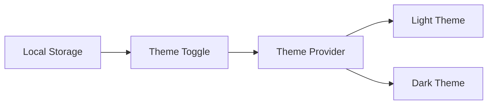
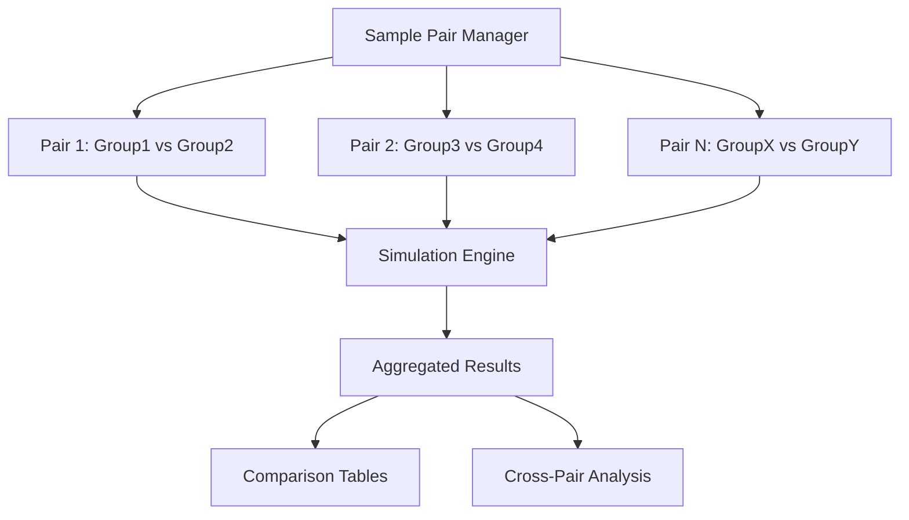
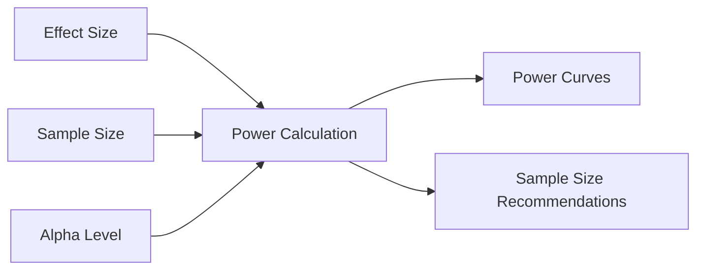

# Phase 2 Expansion Plan: StatDash Enhancement

## Architecture Analysis Summary

### Current Project Structure
The StatDash application follows a clean React architecture with:

**Core Components:**
- [`App.tsx`](src/App.tsx) - Main application container with `AppProvider` context
- [`ControlPanel.tsx`](src/ControlPanel.tsx) - Parameter input sidebar with React context state management
- [`DashboardView.tsx`](src/DashboardView.tsx) - Main content area with tabbed interface
- [`PValueChart.tsx`](src/PValueChart.tsx) - Custom histogram visualization
- [`CIChart.tsx`](src/CIChart.tsx) - Confidence interval "dance" visualization
- [`simulationEngine.ts`](src/simulationEngine.ts) - JavaScript-based statistical simulation engine

**Key Integration Points:**
1. **State Management:** Centralized via React Context (`AppProvider`)
2. **Simulation Engine:** Pure JavaScript implementation with async/await pattern
3. **Data Flow:** Unidirectional from parameters → simulation → results → visualizations
4. **Styling:** Basic CSS with inline styles for charts

## Phase 2 Enhancement Strategy

### 1. UI/UX Transformation with Ant Design

#### 1.1 Modern Component Library Integration
- **Target:** Replace custom CSS with Ant Design components
- **Benefits:** Consistent design language, built-in accessibility, professional appearance
- **Key Components:**
  - [`Form`](https://ant.design/components/form) for parameter inputs
  - [`Table`](https://ant.design/components/table) for result comparisons
  - [`Tabs`](https://ant.design/components/tabs) for dashboard sections
  - [`Card`](https://ant.design/components/card) for organized content blocks
  - [`Button`](https://ant.design/components/button), [`InputNumber`](https://ant.design/components/input-number), [`Switch`](https://ant.design/components/switch)

#### 1.2 Theme System Implementation


- **Components:** `ConfigProvider` with custom theme tokens
- **Persistence:** localStorage for user preference retention
- **Scope:** Application-wide theme consistency

### 2. Enhanced Statistical Simulation Capabilities

#### 2.1 Multiple Sample Pairs Architecture


**Enhanced Data Structures:**
```typescript
interface MultiPairSimulationParams {
  pairs: SamplePair[];
  global_settings: {
    num_simulations: number;
    significance_levels: number[];
    confidence_level: number;
  };
}

interface SamplePair {
  id: string;
  name: string;
  group1: PopulationParams;
  group2: PopulationParams;
  sample_size_per_group: number;
}

interface CrossPairResults {
  pair_comparisons: PairComparisonResult[];
  significance_analysis: SignificanceAnalysis;
  effect_size_comparisons: EffectSizeComparison[];
}
```

#### 2.2 Multiple Significance Thresholds
- **Standard Levels:** 0.01, 0.05, 0.10
- **Custom Levels:** User-defined thresholds
- **Analysis:** Cross-threshold result comparison tables
- **Visualization:** Multi-level significance coloring in charts

### 3. Advanced Statistical Features

#### 3.1 Statistical Power Analysis


#### 3.2 Extended Statistical Tests
- **Welch's t-test:** Unequal variance assumption
- **Mann-Whitney U:** Non-parametric alternative
- **Bootstrap methods:** Enhanced confidence intervals
- **Bayesian analysis:** Posterior probability distributions

### 4. Data Management & Export Enhancement

#### 4.1 Multi-Format Export System
```typescript
interface ExportOptions {
  format: 'csv' | 'json' | 'excel' | 'pdf_report';
  include_charts: boolean;
  include_raw_data: boolean;
  include_summary: boolean;
}
```

#### 4.2 Simulation History & Caching
- **Storage:** IndexedDB for persistent local storage
- **Features:** Simulation replay, parameter comparison, result archiving
- **Performance:** Incremental loading for large datasets

### 5. Enhanced Visualization Suite

#### 5.1 Interactive Chart Library Integration
- **Primary:** Ant Design Charts or Recharts enhancement
- **Features:**
  - Zoom and pan functionality
  - Interactive tooltips with detailed statistics
  - Configurable color schemes matching theme
  - Export chart images

#### 5.2 New Visualization Types
1. **Power Analysis Curves**
2. **Effect Size Forest Plots**
3. **Multi-Threshold Significance Heatmaps**
4. **Bootstrap Distribution Plots**
5. **Bayesian Posterior Plots**

### 6. User Experience Enhancements

#### 6.1 Simulation Presets System
```typescript
interface SimulationPreset {
  id: string;
  name: string;
  description: string;
  parameters: MultiPairSimulationParams;
  created_at: Date;
  tags: string[];
}
```

#### 6.2 Progressive Web App Features
- **Offline capability:** Service worker implementation
- **Performance:** Web Workers for heavy computations
- **Accessibility:** WCAG 2.1 AA compliance
- **Keyboard shortcuts:** Power user workflow optimization

### 7. Implementation Phases

```mermaid
gantt
    title Phase 2 Implementation Timeline
    dateFormat  X
    axisFormat %s

    section Core UI
    Install Ant Design     :0, 1
    Theme System          :1, 2
    Layout Redesign       :2, 4
    
    section Simulation Engine
    Multi-pair Architecture :3, 6
    Advanced Statistics     :5, 8
    
    section Visualizations
    Chart Enhancement      :6, 9
    New Chart Types       :8, 11
    
    section Advanced Features
    Export System         :9, 12
    History & Caching     :10, 13
    PWA Features         :12, 15
```



### 8. Technical Specifications

#### 8.1 Dependencies Addition
```json
{
  "dependencies": {
    "antd": "^5.12.8",
    "@ant-design/icons": "^5.2.6",
    "@ant-design/charts": "^2.0.3",
    "idb": "^8.0.0",
    "jstat": "^1.9.6",
    "file-saver": "^2.0.5",
    "xlsx": "^0.18.5"
  }
}
```

#### 8.2 File Structure Evolution
```
src/
├── components/
│   ├── charts/
│   │   ├── EnhancedPValueChart.tsx
│   │   ├── MultiPairComparisonChart.tsx
│   │   ├── PowerAnalysisChart.tsx
│   │   └── EffectSizeForestPlot.tsx
│   ├── forms/
│   │   ├── SamplePairForm.tsx
│   │   ├── SimulationSettingsForm.tsx
│   │   └── PresetManager.tsx
│   ├── tables/
│   │   ├── ResultsComparisonTable.tsx
│   │   └── SignificanceAnalysisTable.tsx
│   └── layout/
│       ├── ThemedLayout.tsx
│       ├── NavigationSidebar.tsx
│       └── HeaderControls.tsx
├── hooks/
│   ├── useTheme.ts
│   ├── useSimulationHistory.ts
│   └── useStatisticalAnalysis.ts
├── services/
│   ├── enhanced-simulation-engine.ts
│   ├── statistical-tests.ts
│   ├── data-export.ts
│   └── storage-service.ts
├── utils/
│   ├── statistical-utils.ts
│   ├── chart-helpers.ts
│   └── validation.ts
└── types/
    ├── simulation.types.ts
    ├── chart.types.ts
    └── export.types.ts
```

### 9. Educational Value Additions

#### 9.1 Statistical Learning Features
- **Interactive tutorials:** Step-by-step guidance for statistical concepts
- **Explanation panels:** Context-aware help for statistical terms
- **Comparison guides:** Side-by-side explanation of different tests
- **Best practices:** Automated recommendations based on data characteristics

#### 9.2 Real-world Application Examples
- **Case studies:** Pre-built scenarios from different fields
- **Sample datasets:** Realistic data for experimentation
- **Publication-ready outputs:** APA-style result formatting

### 10. Performance & Scalability

#### 10.1 Optimization Strategies
- **Web Workers:** Offload heavy computations
- **Virtual scrolling:** Handle large result sets
- **Incremental rendering:** Progressive chart updates
- **Memoization:** Cache expensive calculations

#### 10.2 Scalability Considerations
- **Memory management:** Efficient handling of large simulations
- **Browser compatibility:** Support for modern web standards
- **Mobile responsiveness:** Touch-friendly interface design
- **Progressive enhancement:** Graceful degradation for older browsers

## Success Metrics

### Functional Requirements
- ✅ Support 1-10 sample pairs simultaneously
- ✅ Multiple significance thresholds (0.01, 0.05, 0.10, custom)
- ✅ Professional UI with dark/light themes
- ✅ Enhanced data export (CSV, JSON, Excel)
- ✅ Result comparison tables
- ✅ Simulation history and presets

### Performance Requirements
- ✅ Handle 10,000+ simulations per run
- ✅ Responsive UI during long-running operations
- ✅ Sub-second theme switching
- ✅ Efficient memory usage for large datasets

### User Experience Requirements
- ✅ Intuitive multi-pair management interface
- ✅ Accessible keyboard navigation
- ✅ Mobile-responsive design
- ✅ Context-sensitive help system

This expansion plan transforms StatDash from a basic simulation tool into a comprehensive statistical analysis platform while maintaining its educational focus and ease of use.